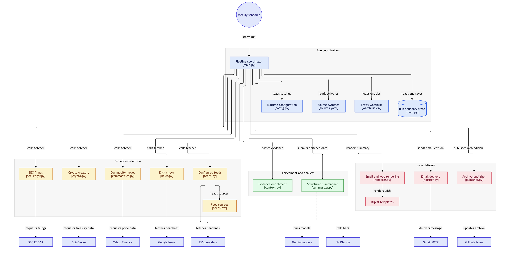
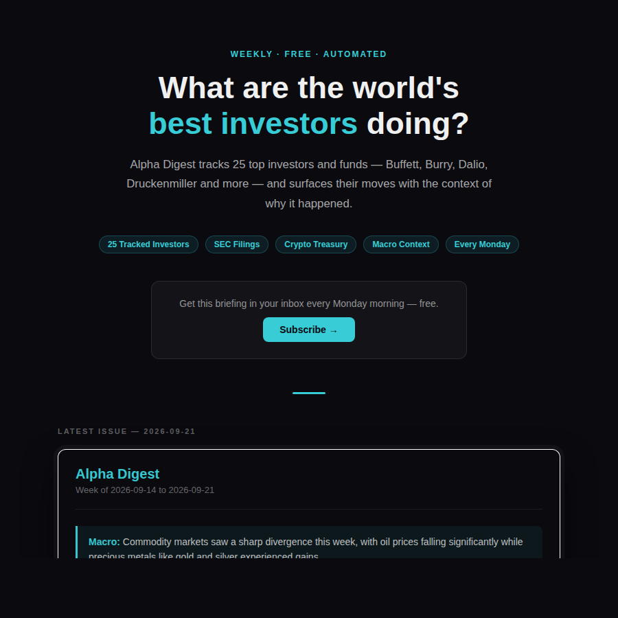

# Alpha Digest

Alpha Digest turns public market disclosures and news into a weekly investor briefing. The pipeline tracks 25 people, funds, companies, and institutions, then emails and publishes the result every Monday.

[](https://github.com/utsapoddar/alpha-digest/actions/workflows/weekly-digest.yml)

**[Read the latest issue](https://utsapoddar.github.io/alpha-digest)**

## Architecture and walkthrough

[](docs/media/architecture.png)

**[Watch the one-minute project explainer →](docs/media/explainer.mp4)** · [Download the architecture PDF](docs/media/architecture.pdf)



## What it does

1. **Fetches primary and secondary evidence.** SEC EDGAR supplies Form 4 and 13F filings. CoinGecko supplies corporate crypto-treasury data. Yahoo Finance supplies weekly commodity moves. Google News and configured RSS feeds supply current context.
2. **Joins evidence to a 25-entity watchlist.** The enrichment stage connects filings, price changes, and headlines to the people or institutions they describe.
3. **Writes a grounded summary.** A cross-provider model chain receives only the collected evidence and must return structured JSON. The prompt forbids unsupported facts, URLs, and investment recommendations.
4. **Builds two outputs.** Jinja templates render an email edition and a web edition from the same structured result.
5. **Delivers and archives the issue.** Gmail SMTP sends the briefing. The publisher writes the current issue and dated archive to the `gh-pages` branch.

## Production path

```text
GitHub Actions (Monday 10:17 UTC)
        |
        v
SEC EDGAR + CoinGecko + Yahoo Finance + RSS
        |
        v
Normalize and enrich against watchlist.csv
        |
        v
Gemini primary models -> NVIDIA fallback
        |
        v
Structured JSON -> Jinja email and web templates
        |
        +--> Gmail SMTP
        |
        +--> gh-pages archive
```

The workflow uses two pinned Gemini models followed by an NVIDIA NIM fallback. Transient failures retry on the current model. Permanent model errors move to the next provider. A 35-minute workflow budget covers the bounded retry path.

## Reliability

Between July 20 and August 10, 2026, four weekly issues were missed in a row (Actions runs #23–26). There were three causes:

- **A retired model.** The pinned NVIDIA-hosted model reached end of life and began returning HTTP 410.
- **Truncated output.** `max_tokens=4096` cut the JSON response mid-string once the 25-entity payload needed about 6,600 completion tokens.
- **An unreachable fallback.** The single model call had no retry, and the 15-minute job limit killed one run before any fallback could be tried.

The fix separates transient errors (connection, timeout, 429, 5xx, bad or empty JSON), which retry on the same model with backoff, from permanent errors, which move straight to the next model. The chain now spans two providers, so a provider-wide outage degrades the run instead of killing it. The job timeout is sized from the worst-case retry path. Every candidate model was verified against a full 25-entity payload, not a toy prompt.

Every scheduled run since August 17 has succeeded: [run history](https://github.com/utsapoddar/alpha-digest/actions/workflows/weekly-digest.yml).

## Design decisions

- **Source-aware ingestion:** each fetcher has a narrow contract and can be enabled independently in `config/sources.yaml`.
- **Failure isolation:** model retries, cross-provider fallback, email fallback storage, and a cached last-run boundary keep one failing service from silently corrupting the issue.
- **Reproducible presentation:** email and web pages are rendered from the same structured response.
- **Privacy separation:** subscriber addresses and credentials stay in ignored local files or GitHub Actions secrets.
- **Deployment evidence:** the public archive and Actions history expose whether the scheduled system is producing output.

## Repository map

```text
main.py                         pipeline coordinator
watchlist.csv                   25 tracked entities and source identifiers
config/sources.yaml             fetcher switches
config/feeds.csv                configured RSS sources
digest/fetchers/                SEC, news, crypto, commodity, and RSS adapters
digest/enrichers/context.py     evidence-to-entity joining
digest/summarizer.py            structured prompt and provider fallback
digest/renderer.py              email and web rendering
digest/notifier.py              SMTP delivery and local fallback
digest/publisher.py             gh-pages publishing
templates/                      Jinja templates
.github/workflows/              weekly production schedule
tests/                          focused summarizer regression tests
```

For a deeper technical walkthrough, see:

- [Architecture](docs/architecture.md)
- [Engineering decisions](docs/engineering-decisions.md)
- [Design walkthrough](docs/design-walkthrough.md)

## Run locally

```bash
python3.12 -m venv .venv
.venv/bin/python -m pip install -r requirements.txt
cp config/recipients.example.yaml config/recipients.yaml
.venv/bin/python main.py --dry-run
```

The dry run writes `data/last_digest.html` and skips email and publishing. Model credentials are still required because summarization is part of the run.

Run the tests with:

```bash
.venv/bin/python -m pytest -q
```

The tests currently cover the summarizer only: provider selection, fallback when a provider has no key, and a clear error on an empty completion. The fetchers, enrichment, and publisher do not have fixture tests yet.

## Configuration

Production reads these GitHub Actions secrets:

- `GEMINI_API_KEY`
- `NVIDIA_API_KEY`
- `GMAIL_ADDRESS`
- `GMAIL_APP_PASSWORD`
- `ALPHA_DIGEST_TOKEN`
- `DIGEST_RECIPIENTS`

Subscriber addresses are not stored in Git. Local recipients live in the ignored `config/recipients.yaml` file.

## Boundaries

Alpha Digest summarizes public evidence. It does not predict returns or recommend trades. Form 13F data is delayed by regulation, news feeds can omit context, and an LLM summary can still be wrong. Every issue should be read as a research starting point, not financial advice.

Built by [Utsa Poddar](https://utsapoddar.github.io).
